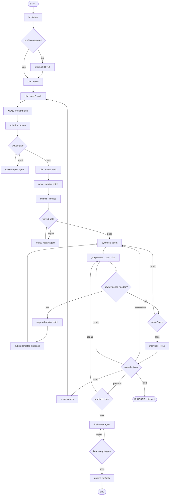
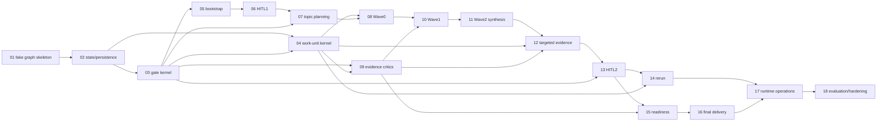

# Plan: DeerFlow 原生 Deep Research Graph

> 类型: 设计 / 架构映射 | 更新: 2026-07-10
> 状态: 待以 Phase 0 spike 验证后拆分为 OpenSpec changes
> 参考: [`../_reference/dpt/`](../_reference/dpt/) 全部 9 份架构分析，以及 DPT 原始 workflow、gate、queue、work-unit、trace 实现

## 结论先行

本计划不是在若干候选方案中选择一个“方案 B”，而是把 DPT 已经存在的架构原样映射到 DeerFlow/LangGraph 的原生运行时。两边都是 **Graph-controlled, Agent-executed（图控流程、Agent 做判断）**：

1. 外层 LangGraph 用传统程序控制可枚举的 phase、HITL、fan-out/fan-in、重试上限、暂停与恢复。
2. 每个需要开放式判断的 research node 内运行一个受限 DeerFlow agent loop。
3. 确定性 gate 是独立 node；失败时把结构化错误和自然语言 `inspect/advice` 写回 state，再路由到同一 phase 的 repair agent loop。
4. LangGraph state/checkpointer 管小而关键的控制状态；sandbox 管大体积证据和报告文件；通过验证的 submission ledger 管证据权威。
5. 在当前“只能注册 `lead_agent`、不能修改 `backend/`/`frontend/`”的约束下，先把该 graph 做成顶层自有 Python 包中的 **嵌套 graph**，通过一个 custom tool 接入现有 lead agent。

核心架构没有变化，变化的是 controller 的承载方式：

```text
DPT
  隐式 Graph       = phase Markdown + transitions.chain.json
  Controller       = Phase Agent 读取当前 MD、执行 gate、消费 check.next
  State            = bundle JSON/JSONL + trace
  Node executor    = 当前 phase 内的 agentic loop

DeerFlow
  显式 Graph       = Python StateGraph + edges
  Controller       = LangGraph/Pregel 按 Python 控制流推进
  State            = typed ResearchState + checkpointer
  Node executor    = 当前 node 内的 DeerFlow agent loop
```

DPT 的 phase、gate、state、queue、work-unit、submit、repair、HITL 和证据权威都继续存在，基本是一一映射；只是把原来由 `Phase Agent + Markdown` 隐式维持的程序控制，物化成 Python graph 和 typed state。Markdown 仍然保存每个节点的任务合同、研究规则和修复指导，但不再持有全局 program counter。

程序只决定已经可枚举、应该确定的控制问题；LLM 继续拥有研究问题拆解、搜索策略、证据解释、缺口判断、修复策略、综合和写作等语义判断权。因此它仍然是自然的 agentic flow，不是把研究判断改写成脚本。

## 背景 / 现状

### DPT 的原生架构

DPT 不是简单的“11 个 prompt 串起来”，也不是一个单一 Agent 叠加若干 skill。它本身就是由 11 个职责受限的 agentic phase node、显式 gate、phase-local queue 和 work-unit 构成的 workflow graph：

| 能力 | DPT 机制 | 真正要保留的性质 |
|---|---|---|
| 阶段控制 | Markdown phase + passive chain + gate handoff | 未经 gate 授权不能越过 phase |
| phase 内工作调度 | queue active window/refill/in-flight | bounded demand、并发上限、drain 后才过 gate |
| 委托可信度 | work-unit claim/submit + receipt + ledger | 子 agent 的“我完成了”不算完成，验证后的 submit 才算 |
| 恢复与审计 | append-only trace + status projection | 能从权威记录恢复，不能靠手改状态伪造进度 |

DPT 的核心优点是权威边界清楚：

```text
Agent / Markdown 负责可犯错的判断
Engine 负责不可造假的检查与状态迁移
Sub-agent 只负责一个有界工作单元
Gate 只承认验证后提交的证据
```

### 相同架构，不同 runtime substrate

下列机制不是要被否定，而是 DPT 在 Markdown/coding-agent substrate 上实现 graph/state/gate 语义的具体办法：

- `transitions.chain.json`、`enter-phase`、`advance-status` 三套表面共同证明一次 phase handoff。
- `rb_status.json` 只是 cache，却还要与 `rb_trace.jsonl` 做 drift audit。
- queue/index/ledger 是多个 JSON/JSONL 文件，因此 submit 需要锁、快照、回滚和 durable postcondition。
- Markdown 动态加载需要 dependency DAG、loader receipt、mode banner 和 package consistency validator。
- stop authorization 只能写成约定，实际并未被完整强制。
- phase agent 必须自己记得 claim、poll、submit、repair、drain、gate、load-next，导致 phase Markdown 极长。

LangGraph 已经原生拥有 state、reducer、edge、checkpoint、interrupt、`Send`/并行 superstep 和可测试的 node 边界。映射时保留上述机制的语义和不变量，但把实现落到原生 primitive 上，而不是逐文件翻译为 Python：

| DPT runtime 实现 | DeerFlow/LangGraph 原生映射 |
|---|---|
| phase Markdown 持有当前阶段控制面 | Python node 选择并加载当前阶段 prompt/contract |
| Phase Agent 消费 `check.next` 推进 | StateGraph edge/`Command` 推进 |
| `rb_status.json` + trace 重建当前状态 | checkpointed typed state 直接保存当前状态 |
| queue active/refill/in-flight | pending work + bounded `Send` batch + reducer |
| work-unit claim/submit | immutable WorkSpec + worker node + deterministic submit node |
| gate CLI | deterministic gate node，仍返回 `inspect/advice` 给 repair agent |
| enter/load/advance handoff witness | committed graph superstep/checkpoint |
| stop/HITL Markdown 约定 | graph interrupt + resume |

所以不是“删掉 DPT 的 state/gate/queue”，而是消除它们为了模拟 workflow runtime 而产生的重复文件协调。逻辑状态、门禁和工作单元仍然逐项存在。

### DeerFlow 当前可直接复用的能力

| DeerFlow 能力 | 映射用途 | 边界 |
|---|---|---|
| `create_deerflow_agent()` | 在 research worker/synthesis/report node 内建立受限 agent loop | node 内无独立业务控制权 |
| sandbox + thread isolation | 存证据缓存、结构化产物、报告 | 不把“文件存在”直接当提交成功 |
| model/tool config | 不同 node 选择模型、工具白名单 | 由 graph/node policy 决定，不由 worker 自选 |
| middleware | tool error、guardrail、read-before-write、loop detection、预算 | 不能替代 research gate |
| custom subagent / `SubagentExecutor` | 可作为 worker 执行后端候选 | 当前 subagent 无 checkpointer，文本返回不是证据权威 |
| checkpointer | 保存 graph 的小型控制状态和 interrupt | 不存网页正文、大文件或完整证据库 |
| run events / tracing | 用户进度与运行诊断 | 不直接替代 claim-level provenance ledger |
| custom Agent + SOUL.md | 强制入口 agent 调用 research tool，而不是自行研究 | 仍需测试 tool-selection 可靠性 |
| `Command(goto=END)` + human-input artifact | 把嵌套 graph 的 HITL 映射到现有 UI | 需要 Phase 0 证明恢复链路 |

### 需要修正的旧 mapping 偏差

`openspec/config.yaml` 和参考 mapping 目前已经把以下内容写成既定规则：

- phase flow 必须 Agent-driven，不使用 conditional edge；
- research business state 不使用 checkpointer；
- stop 只靠 skill 的 `stop` 字段；
- phase 主要实现为 11 个 deferred skills。

这些结论把 DPT 在特定 substrate 上的 controller 实现误当成了不可改变的架构原则。DPT 真正需要保留的是 phase graph、agentic node、gate feedback、state 和提交权威，而不是“必须由 Markdown/Phase Agent 持有 program counter”。

因此在实施前必须显式更新项目设计规则，让它描述同构映射：DPT 由 Markdown controller 驱动；DeerFlow 由 Python StateGraph controller 驱动；两者的 research graph 和质量控制合同基本相同。

## DPT → DeerFlow 一一映射

| DPT 架构角色 | DeerFlow 映射 | 保持不变的合同 |
|---|---|---|
| 11 个 phase node | StateGraph 中职责受限的 phase nodes | 单 phase 上下文、明确输入/产物、未经 gate 不推进 |
| phase Markdown | node-specific prompt/contract Markdown | 研究规则、工具策略、失败修复指导 |
| Phase Agent controller | Python StateGraph/Pregel controller | 一次只处于合法 phase，按 gate outcome 流转 |
| `transitions.chain.json` | explicit graph edges / routers | 合法 transition 是静态、可检查的闭集 |
| bundle control state | typed ResearchState + checkpoint | 可恢复、可审计、不能靠 LLM 自报推进 |
| queue | pending/in-flight/terminal work state + batches | phase-local demand、并发上限、drain 后过 gate |
| work-unit envelope | immutable WorkSpec + scoped worker context | worker 身份、范围、输出合同、attempt 隔离 |
| sub-agent | node 内 DeerFlow agent loop | 有界任务、噪声隔离、无 phase/gate 权限 |
| `operate-work-unit submit` | deterministic submit node | 只有验证后的 submission 才计 evidence coverage |
| gate CLI | deterministic gate node | collect-all failures、自然语言反馈、不可假通过 |
| gate fail repair | edge 回到 phase repair agent | Agent 决定怎么修，controller 决定必须修后再验 |
| HITL1/HITL2 | graph interrupt/resume nodes | 明确等待点、原始用户决策、可恢复 |
| trace/reentry | checkpoint + audit events/ledger | 从权威执行记录恢复，不从聊天猜测 |

### Graph control 与 agentic repair 的边界

conditional edge 只读取 gate 的 typed verdict，例如 `pass | repair | blocked | needs_human`。它不决定搜索关键词、不写修复内容、不判断一个矛盾的学术含义。

Gate 失败的 narrative 不会被 edge 吞掉：

```text
gate node
  -> state.gate_feedback = {codes, inspect, advice, failed_refs}
  -> conditional edge = repair
  -> phase repair agent 读取 gate_feedback，自主修复
  -> 回到同一 gate
```

程序决定“失败后回修复节点”；Agent 决定“如何修复”。DPT 也是这个结构，只是 DPT 的程序推进动作由 Phase Agent 按 Markdown 执行，DeerFlow 中由 Python graph runtime 执行。

### 嵌套 graph 只是当前挂载方式

由于当前 DeerFlow 只注册 `lead_agent` 且禁止修改上游，第一版通过 custom tool 挂载嵌套 StateGraph。这不构成另一套 workflow 方案，也不改变上表的架构映射。

未来若 DeerFlow 提供 config-driven graph registration，可以把同一个 graph factory 直接注册，以获得原生 subgraph streaming 和 interrupt 展示；phase、state、gate、work-unit 设计无需改变。

## 目标架构

```text
User / UI
    |
    v
DeerFlow registered lead_agent
  dedicated deep-research custom Agent + SOUL
    |
    | tool call: deep_research(action=start|resume|status|cancel)
    v
Our top-level package: DeepResearchTool
    |
    | compile/invoke with isolated checkpoint namespace
    v
DeepResearch StateGraph
    |
    +-- deterministic nodes: bootstrap, route, gates, submit, readiness
    +-- HITL nodes: LangGraph interrupt -> tool translates to human_input + END
    +-- fan-out/fan-in: bounded Send batches + reducers
    +-- agent nodes: DeerFlow agent loop with phase-specific prompt/tool policy
    |
    +--> LangGraph control state/checkpoint  (small, typed, resumable)
    +--> sandbox research bundle            (large artifacts/evidence/cache)
    +--> append-only submission ledger      (validated evidence authority)
```

### 三层控制结构

#### Layer 1: 外层 DeerFlow shell

职责：

- 复用现有 UI、auth、thread、run lifecycle、sandbox acquisition 和 artifact presentation。
- 识别 deep-research custom agent/skill 入口并调用唯一 research control tool。
- 将嵌套 graph 的 HITL suspension 映射成现有 `human_input` ToolMessage。
- 在最终完成后展示 report artifacts。

不负责：

- 自己搜索、自己推进 wave、自己判断 gate 是否通过。
- 从自然语言猜测 research graph 当前 phase。
- 将用户的 HITL 答案改写后再传入；resume 应从 runtime 最新真实 HumanMessage 读取原文。

#### Layer 2: Deep Research StateGraph

职责：

- 唯一 phase cursor、合法 edge、retry counter、HITL suspension、rerun generation。
- 创建 bounded work specs，控制并发批次，汇合 worker results。
- 调用 deterministic submit/gate，只有验证后才能更新 evidence authority。
- 使用 checkpoint 恢复，而不是让 LLM 从聊天记录猜恢复点。

不负责：

- 直接做开放式研究判断。
- 把大网页、长证据或报告全文放进 graph state。

#### Layer 3: Agent-loop nodes

职责：

- topic decomposition、搜索策略、来源甄别、证据提取、矛盾分析、跨 topic 综合、报告写作。
- 读取本 node 的 prompt contract、允许的 artifact refs、gate feedback。
- 通过受限工具集产出结构化 result 和文件。

不负责：

- 修改 phase、gate result、submission ledger 或其他 work item 状态。
- 自己宣布“本 wave 已完成”。
- 读取未来 phase prompt 或绕过 graph 跳转。

## Graph 设计

### 建议的逻辑图



### 不机械保留 DPT 的 11 phase

| DPT phase | Graph 处置 | 理由 |
|---|---|---|
| instantiation + setup | 合并为 deterministic `bootstrap` | graph/store 可原子初始化，不需要 LLM 创建模板文件 |
| hitl1 | 保留为强制 interrupt | 用户决定 profile/root questions，必须可恢复 |
| seed-topics | `plan_topics` agent + schema gate | 语义判断需要 LLM，物化由代码完成 |
| wave0 | plan -> worker batch -> submit -> gate | 广度证据并行收集 |
| wave1 | plan -> worker batch -> submit -> gate | 深度证据并行提取 |
| wave2 | synthesis -> gap planner -> targeted workers -> gate | 明确区分纯综合与新证据搜索 |
| hitl2 | 保留为强制 interrupt + typed decision | 用户对成果、限制和补证方向作决定 |
| readiness | deterministic + semantic critic gate | 最终写作前阻止证据闭包不完整 |
| rerun | `rerun_generation += 1` + scoped invalidation | 不重建整个 bundle，不覆盖旧证据 |
| final | writer agent + final integrity gate + publish | 写作仍 agentic，交付必须 gate |

### Node 内 agent loop 的构造原则

每类 node 使用独立 prompt、工具和输出合同，不共享一个万能 research agent：

| Node 类型 | Agent loop | 工具策略 | 结构化输出 |
|---|---|---|---|
| topic planner | 是 | 无 web，读用户输入/profile | topics、must-answer、search dimensions |
| wave0 intake worker | 是 | web search/fetch + scoped write | source candidates、cache refs、baseline facts |
| wave1 evidence worker | 是 | web search/fetch + scoped write | claims、counterevidence、open questions、source refs |
| source/claim critic | 是 | 只读已有 evidence；必要时给 gap request | verdicts、weak claims、required follow-ups |
| wave2 synthesis | 是 | 只读 submitted evidence + synthesis write；禁止 web | findings、relations、contradictions、gaps |
| targeted gap worker | 是 | 仅 assigned gap 的 web tools | gap result、claims、source refs |
| report writer | 是 | 只读 validated evidence + report write | report refs、claim-to-citation map |
| repair agent | 是 | 由 gate code 选择最小工具集 | repaired refs + explanation |

所有 agent loop 都是 bounded：有 turn limit、token budget、wall timeout、允许路径和允许工具。到达上限是 typed failure，不是默默接受 partial result。

## State 设计

### 控制 state 只存小数据

建议 `ResearchState` 至少包含：

```text
identity
  research_id, outer_thread_id, generation, schema_version

request
  original_question, normalized_brief_ref, profile, must_answer_questions

control
  phase, phase_status, waiting_for, terminal_status
  gate_attempts_by_phase, repair_budget_by_phase

planning
  topic_refs, active_wave, pending_work_ids, batch_cursor

work
  work_specs_by_id (small immutable metadata)
  work_status_by_id (pending/running/submitted/failed/timed_out/cancelled)
  accepted_submission_refs

quality
  latest_gate_feedback, unresolved_gaps, degraded_decisions
  answerability, citation_closure_summary

delivery
  synthesis_ref, decision_brief_ref, report_refs
```

网页正文、PDF、完整 evidence summary、完整报告、截图和大 tool output 不进入 state，只存 sandbox path、hash、schema version 和短摘要。

### Reducer 不变量

并行 worker result 需要自定义 reducer，至少保证：

- `work_id` 同一 attempt 只能出现一个 terminal winner。
- terminal 状态不能被 `running` 或晚到的旧状态降级。
- 同一 work/attempt 的重复结果如果 hash 相同则幂等；hash 不同则标记 conflict，不能 last-write-wins。
- accepted submission refs 去重追加。
- evidence claim ID 全 run 唯一；同 ID 内容不一致时 fail closed。
- gate feedback 只由 gate node 覆盖，worker 无写权限。

### Context 与 state 分离

以下运行时对象通过 LangGraph context 传入，不进入 checkpoint：

- parent sandbox state / thread data；
- resolved AppConfig、model/tool handles；
- authenticated user/run attribution；
- stream writer、cancellation signal；
- secret/provider credentials。

## 权威数据模型

### 三种真相，不再五个控制文件互相校验

| 真相 | 权威载体 | 内容 |
|---|---|---|
| 控制真相 | LangGraph checkpointed `ResearchState` | phase、interrupt、retry、work status、合法 transition |
| 证据真相 | append-only validated submission ledger | 哪些 work output/claim/source 已被正式接受 |
| 内容真相 | sandbox artifact files | 页面缓存、evidence、synthesis、report |

不再保留 DPT 风格的 `rb_status.json` 作为第二个 phase cursor，也不需要 `enter-phase/load_complete/advance-status` 三步 handoff witness。Graph checkpoint 本身就是合法执行路径。

### 为什么还需要 submission ledger

LangGraph checkpoint 能证明某个 node 返回过，不能单独证明一个网页来源真实可读、一个输出文件符合 schema、一个 worker 没有伪造路径。

因此 submission ledger 仍是 evidence coverage 唯一权威。每条 `SubmissionRecord` 至少包含：

- logical work id + attempt id + generation；
- worker role、phase、topic/finding scope；
- immutable WorkSpec hash；
- output file refs + content hashes；
- source claims + canonical URL + fetched/cache refs；
- result schema version；
- validator version和通过的 checks；
- submitted timestamp；
- record hash / previous-record hash（如采用 hash chain）。

Gate 只能读取 accepted submission records。裸文件、worker 最终文本、tool event 和 `running` 状态都不计 coverage。

### 最小 bundle

建议从 DPT 的大 bundle 缩减为：

```text
workspace/deep-research/<research_id>/
├── request/
│   ├── brief.json
│   └── profile.json
├── work/
│   └── <work_id>/<attempt_id>/
│       ├── work-spec.json
│       ├── result.json
│       └── outputs/...
├── evidence/
│   ├── sources/...
│   ├── claims.jsonl
│   └── submissions.jsonl
├── synthesis/
│   ├── findings.json
│   ├── gaps.json
│   └── synthesis.md
├── review/
│   └── decision-brief.md
├── final/
│   ├── report.md
│   └── claim-citation-map.json
└── diagnostics/
    └── gate-attempts.jsonl
```

`diagnostics/gate-attempts.jsonl` 用于解释和审计，不作为 phase cursor。

## Work Unit 原生映射

### 保留的 DPT 性质

- graph/controller 分配 work/attempt id，worker 不自行分配。
- WorkSpec 不可变并带 hash。
- worker 只能写自己的 attempt 目录和公共 cache 的受控区域。
- worker result 必须满足 versioned schema。
- submit node 验证身份、路径、hash、来源和输出后才记 ledger。
- retry 新建 attempt id，不复活失败 attempt。
- gate 只看 accepted submissions。

### 第一版由 LangGraph primitive 承担的机制

- active window/refill 的 bounded-demand 语义由 typed pending list 和 bounded `Send` batch 承担。
- queue/index 的状态事务由 graph state/checkpoint 承担；ledger 仍在 submit 成功后 append。
- worker lifecycle receipt 的诊断语义由 node/run events 承担；证据权威仍由 submit validator 承担。
- 第一版对过期 attempt fail closed，不启用 late-submit winner；后续只有确有需要才补等价状态机。
- claim/poll/drain 由 fan-out/fan-in nodes 承担，不再要求 Phase Agent 手动执行 CLI。

### Fan-out / fan-in

1. planner 生成 immutable `WorkSpec[]`。
2. batch router 按配置取不超过并发上限的一批。
3. 使用 LangGraph `Send` 并行调用 worker nodes。
4. worker node 内运行 DeerFlow agent loop，返回 candidate result ref。
5. reducer 合并 candidate results。
6. submit node 逐项确定性验证并写 accepted ledger。
7. 尚有 pending work 则下一个 batch；全部 terminal 后进入 wave gate。

这样并发拓扑由代码控制，worker 的研究过程仍由 agent 控制。

## 质量控制

### 三层质量门禁

#### 1. Hard gate: 确定性、不可降级

适合 Python/Pydantic/结构化 parser：

- schema、枚举、版本、路径 containment；
- output exists/non-empty/hash matches；
- work/attempt/spec identity 一致；
- canonical URL 去重、source cache/fetch receipt 存在；
- claim citation refs 可解析；
- per-profile 数量 floor；
- no orphan/duplicate/conflicting submission；
- pending/in-flight 为零；
- report 中引用的 claim/source 都在 accepted ledger；
- 高优先级 finding 没有未路由 gap。

这些 gate 不能 degraded pass，也不能由 LLM 覆盖。

#### 2. Semantic critic: Agent 判断、结构化输出

由独立 critic/claim-verifier agent 执行，不让作者自评即通过：

- 来源是否真的支持 claim；
- claim 是 supported/weakened/contradicted/uncertain；
- 是否遗漏关键反例或争议；
- topic coverage 是否回答 root must-answer；
- synthesis 是否把相关性误写成因果；
- 限制与不确定性是否被正确表达；
- report 是否忠实投影 evidence，而非引入新事实。

Semantic critic 只产出 typed findings。是否达到阈值和如何路由仍由 gate node 控制。

#### 3. Human gate

- HITL1：研究边界、profile、必须回答的问题、时间/成本倾向。
- HITL2：已确认结论、关键不确定性、补证优先级、proceed/repair/rerun/stop。

人类决定不能伪装成证据。即使用户选择 proceed，hard provenance gate 仍不能绕过。

### Wave gate 建议

#### Wave0 gate

- 每个 topic 达到 profile 的独立来源 floor。
- 来源 URL canonical 后无重复计数。
- 每个来源有 fetch/cache 或明确 degraded capture。
- baseline fact 与 source claim 有绑定。
- 无 pending/in-flight work。

#### Wave1 gate

- 每个 topic 覆盖 mechanism、trend/difficulty、limitation/dispute/failure mode。
- new-source floor 不被 Wave0 重复 URL 冒充。
- counterexample/cross-verification 要求满足或显式 gap。
- claim critic 已运行，重大 unsupported claim 已移除或降级。
- open questions 已分类为 resolved / targeted-search / deferred / requires-internal-data。

#### Wave2 gate

- synthesis 只读 accepted evidence；synthesis node 无 web tool。
- finding index、cross-topic relations、contradictions 和 gap routing 完整。
- 需要新证据的 finding 必须走 targeted work + submit。
- P0/P1 finding 达到独立 backing floor或被显式阻塞/交给 HITL2。
- `pure_synthesis_eligible` 由代码从 gap 状态导出，不让 agent 自填。

#### Readiness gate

- root must-answer 每项都有 answerability verdict。
- 所有重大 claim 有足够独立 backing。
- citation closure 100%，无 dangling source/claim/ref。
- 用户 HITL2 决策已经记录并适用于当前 generation。
- degraded decision、局限和未解决问题都进入 report plan。

#### Final integrity gate

- 最终报告没有引用 ledger 外的新事实。
- claim-citation map 与 report 引用双向闭合。
- 报告结论强度不高于 evidence verdict。
- final artifacts 存在、hash 固定并通过 `present_files` 暴露。

### Gate failure policy

每次 gate 返回统一结构：

```text
verdict: pass | repair | blocked | needs_human
codes: stable machine-readable codes
inspect: 发现了什么
advice: 建议 Agent 如何修复
failed_refs: 相关 work/claim/artifact refs
attempt: 当前次数
remaining_repairs: 剩余预算
degradation_allowed: bool + allowed scope
```

规则：

- collect all failures，不 first-match 后让 agent 逐个踩雷。
- repair agent 必须看到完整反馈。
- 相同 failure fingerprint 连续出现时升级建议或换 strategy。
- retry budget 用 state 强制，不靠 prompt。
- provenance/schema/identity 错误永不降级。
- 只有来源不可访问、外部数据不存在等预先定义情形允许带限制继续。

## HITL、恢复与终止

### HITL bridge

嵌套 graph 在 HITL node 调用 `interrupt(payload)`，payload 包含稳定 request id、问题、上下文、选项和当前 research generation。

Custom tool 收到 suspension 后：

1. 生成现有前端认识的 `ToolMessage(artifact={"human_input": ...})`。
2. 返回 `Command(update={messages:[...]}, goto=END)`，结束外层当前 run。
3. 用户回复形成新的真实 HumanMessage。
4. 专用 lead agent 调用 `deep_research(action="resume")`。
5. tool 从 runtime state 读取最新真实 HumanMessage，校验 suspension id，再用 `Command(resume=raw_answer)` 恢复嵌套 graph。

不能让 lead LLM 把答案总结/改写后作为唯一 resume payload。

### Checkpoint namespace

- outer DeerFlow thread 与 research graph 共享用户/thread 归属，但使用独立 `checkpoint_ns` 或派生 research thread key。
- key 至少包含 authenticated user、outer thread、research id；不能相信模型传入任意 thread id。
- 同一 outer thread 第一版只允许一个 active research run；并行 run 需要显式 research id 和 UI 选择后再开放。
- resume 前验证 checkpoint 所处 suspension 与当前 generation。

### Reentry

不让 agent 读 `rb_status.json` 猜位置。Tool 的 `status`/`resume` 直接读取 nested graph checkpoint：

- interrupted：返回等待哪个 HITL request；
- running/unknown after crash：从最后 committed superstep 恢复，未提交 worker 重跑；
- completed：幂等返回 final refs；
- blocked/cancelled：返回稳定 terminal reason；
- schema incompatible：停止并要求显式 migration，不静默重置。

### 非交互运行

scheduled/non-interactive context 不能卡在 HITL：

- profile 和 HITL2 policy 必须随任务配置提供；或
- 明确选择 `auto_profile + auto_proceed_with_limitations` policy，并写审计记录。

非交互模式不得伪造 human decision，也不得把 hard gate 自动降级。

## 充分利用 DeerFlow 的具体方式

| DeerFlow 特点 | 具体用法 |
|---|---|
| Node 内 agent loop | planner/worker/critic/synthesis/writer 都由 `create_deerflow_agent()` 建立 bounded loop |
| Middleware | 每个 loop 复用 tool error、guardrail、read-before-write、loop detection、token budget |
| Sandbox | 所有 worker 共享 outer thread sandbox，但按 research/work/attempt 路径授权 |
| Tool config/reflection | `deep_research` control tool 由 `tools[].use` 加载；worker tool set 从 AppConfig 筛选 |
| Models | cheap model 做 intake/format；strong model 做 synthesis/critic/final，可配置 |
| Skills | 只保留 entry/operator skill；phase contract 由 graph node 按需加载，不把未来 phase 全塞给 lead |
| State/reducers | work results、claims、artifacts 并发合并，terminal 状态单调 |
| Checkpointer | phase、interrupt、batch cursor、repair attempt 可恢复 |
| `Send` | topic/finding work 的有界 fan-out/fan-in |
| run events | 发布 phase/batch/gate/usage 进度；不把低层网页噪声塞进 lead messages |
| Artifacts | final report 和 decision brief 通过已有 artifacts/present_files 通道展示 |
| Custom agent | dedicated SOUL 强制所有研究控制都进 tool，降低 lead 自行旁路概率 |

## Phase 0: 必须先证明的集成门槛

Phase 0 对应 01-04 四个 change，期间不实现任何真实研究节点：

```text
01 完整 fake graph：全 node、全 edge、HITL、rerun、fake final
02 typed state/checkpoint：把 fake dict 换成正式控制合同
03 gate kernel：把直接 fixture outcome 换成通用 fake rules + repair loop
04 work-unit kernel：把 fake phase 内直返换成 bounded Send + fake worker + submit
```

完成后得到的是“控制面、状态面、门禁面、工作调度面都真实，研究内容仍是 fixture”的完整骨架。05 才开始替换第一个真实业务 node。

### P0-1 顶层包可加载

现状实测：标准 Gateway 从 `backend/` 以 `PYTHONPATH=.` 启动，`sys.path` 不包含 repo root。当前“顶层 `agent/` 可直接被 `tools[].use` 反射加载”的项目假设并不成立。

必须在不修改 `backend/`/`frontend/` 的前提下选定并验证一种正式装配方式：

1. project-owned additive launcher / Docker override，把 repo root 加入 `PYTHONPATH`；或
2. 将自有包作为正式安装依赖装入 backend venv 的可重复 setup；或
3. fallback 到 stdio MCP/ACP bridge。

完成标准：local dev、prod 和 Docker 使用同一种声明式安装/加载路径；重启和 `uv sync` 后仍可加载。

### P0-2 Nested graph checkpoint

- 与 outer graph 使用相同配置的 memory/sqlite/postgres backend。
- 独立 namespace 不污染 lead-agent checkpoint。
- process restart 后从 interrupt 恢复。
- schema/version mismatch fail closed。

### P0-3 HITL UI bridge

- nested interrupt 显示为现有 structured human-input UI。
- 外层 run 结束且不追加伪 final answer。
- 下一条用户消息恢复正确 research id/request id。
- 重复 resume 幂等；错 request id 拒绝。

### P0-4 Shared sandbox and tool policy

- node 内 agent loop 能读写 outer thread sandbox。
- 只能写 assigned research/work path。
- synthesis node 实际拿不到 web tools。
- worker 拿不到 phase/gate/ledger mutation tools。

### P0-5 Fan-out、取消和孤儿清理

- 三个 `Send` worker 并行，结果 reducer 不丢失。
- 用户取消 outer run 时 worker 收到 cancellation；不能后台继续写 ledger。
- crash 后未提交 attempt 可安全重跑，已提交 attempt 幂等跳过。

### P0-6 Streaming / observability

- nested graph 能向 outer stream 发布 phase、batch、gate 粒度事件。
- 若当前 tool/subgraph streaming 无法进入现有 run events，先明确第一版只显示 coarse progress，并记录直接注册 graph 的长期迁移条件。

**01-04 或上述任一硬门槛失败，不开始 05-16 的真实 node 替换。** 先修正 substrate 和公共内核，避免在不稳定骨架上堆业务逻辑。

## Change 拆分路线图

本主文档只保存总体架构。下面每个子 plan 必须一对一生成一个 OpenSpec change；不再用一个 change 同时实现多个真实 phase。

拆分遵循四条规则：

1. **先搭完整 fake graph。** 第一个 change 就交付全拓扑、全 edge、两个 HITL、rerun 回边和 fake final，所有节点先返回确定性 fixture。
2. **逐节点替换，不最后集成。** 后续 change 每替换一个 fake node，全图端到端测试仍必须通过。
3. **横切内核先于真实 node。** state、gate、work-unit 是所有 phase 的共同依赖，各自独立 change。
4. **一个 plan 对应一个 change。** 子 plan 的验收边界就是对应 change 的 archive gate，不把未完成工作藏在“后续补齐”里。

### Change 清单

| # | 子 plan / 对应 change | 替换或建立的边界 | 直接依赖 |
|---:|---|---|---|
| 01 | [`deep-research-01-fake-graph-skeleton.md`](deep-research-01-fake-graph-skeleton.md) | 可挂载、可 checkpoint、可 HITL 的完整 fake graph | 无 |
| 02 | [`deep-research-02-state-persistence-contracts.md`](deep-research-02-state-persistence-contracts.md) | typed state、reducers、bundle refs、checkpoint schema | 01 |
| 03 | [`deep-research-03-gate-kernel.md`](deep-research-03-gate-kernel.md) | 通用 gate/repair/retry/fatigue 内核，先接 fake rules | 02 |
| 04 | [`deep-research-04-work-unit-kernel.md`](deep-research-04-work-unit-kernel.md) | WorkSpec、bounded `Send`、submit ledger、fake worker | 02, 03 |
| 05 | [`deep-research-05-bootstrap-node.md`](deep-research-05-bootstrap-node.md) | 替换 fake bootstrap | 02, 03 |
| 06 | [`deep-research-06-hitl1-node.md`](deep-research-06-hitl1-node.md) | 替换 fake HITL1/profile interrupt | 05 |
| 07 | [`deep-research-07-topic-planning-node.md`](deep-research-07-topic-planning-node.md) | 替换 fake topic planner/seed materialization | 03, 06 |
| 08 | [`deep-research-08-wave0-node.md`](deep-research-08-wave0-node.md) | 替换 fake Wave0 intake phase | 04, 07 |
| 09 | [`deep-research-09-evidence-critic-nodes.md`](deep-research-09-evidence-critic-nodes.md) | source diagnostic + claim verifier agent nodes | 03, 04 |
| 10 | [`deep-research-10-wave1-node.md`](deep-research-10-wave1-node.md) | 替换 fake Wave1 evidence-depth phase | 08, 09 |
| 11 | [`deep-research-11-wave2-synthesis-node.md`](deep-research-11-wave2-synthesis-node.md) | 替换 fake pure-synthesis node | 10 |
| 12 | [`deep-research-12-targeted-evidence-loop.md`](deep-research-12-targeted-evidence-loop.md) | 替换 fake gap planner/targeted-search loop + Wave2 gate | 04, 09, 11 |
| 13 | [`deep-research-13-hitl2-node.md`](deep-research-13-hitl2-node.md) | 替换 fake HITL2 decision node | 03, 12 |
| 14 | [`deep-research-14-rerun-node.md`](deep-research-14-rerun-node.md) | 替换 fake rerun generation/back edge | 04, 13 |
| 15 | [`deep-research-15-readiness-node.md`](deep-research-15-readiness-node.md) | 替换 fake readiness gate | 09, 13 |
| 16 | [`deep-research-16-final-delivery-node.md`](deep-research-16-final-delivery-node.md) | 替换 fake writer/final integrity/publish | 15 |
| 17 | [`deep-research-17-runtime-operations.md`](deep-research-17-runtime-operations.md) | cancellation、non-interactive、progress、operator recovery | 14, 16 |
| 18 | [`deep-research-18-evaluation-hardening.md`](deep-research-18-evaluation-hardening.md) | 全链路 eval、故障注入、生产 hardening | 17 |

### 依赖关系



### 可并行车道

- 02 完成后，03 的 gate kernel 与 state 相关测试先行；03 完成后 04 和 05 可以并行。
- 04 完成后，09 可用 fixtures 开发，不必等 Wave0/Wave1 真实 node。
- 13 完成后，14 rerun 与 15 readiness 可以并行；16 只依赖 15。
- 17 必须等待 14 和 16，因为 cancellation/recovery/non-interactive 要覆盖两个终态方向。

### Fake graph 的持续合同

01 之后，graph topology snapshot 成为固定合同。每个 node 至少有两套实现：

```text
FakeNode: deterministic fixture，供图级快速测试
RealNode: 对应 change 落地后的真实实现
```

运行配置允许测试选择 fake/real implementation map。一个 change 只能把自己的目标 node 从 fake 切到 real；未轮到的 node 继续 fake。这样 Wave0 尚未完成时也能测试 HITL2、rerun、readiness 和 final 的控制流，不把集成风险推迟到最后。

每个 change 的统一 done 条件：

- 对应子 plan 的 scope 全部实现；
- targeted node 的 fake/real contract tests 通过；
- full fake graph test 通过；
- “已实现节点为 real、其余为 fake”的 mixed-graph E2E 通过；
- requirement registry 和两个 governance checker 通过；
- `backend/`、`frontend/` 无修改。

## 测试与评估计划

### 确定性单元测试

- graph transition table completeness / unreachable node / accidental cycle。
- reducer 的交换性、幂等性、terminal monotonicity、conflict detection。
- WorkSpec/result/submission schema。
- path containment、hash、canonical URL、duplicate coverage。
- gate collect-all、stable error codes、retry/degradation policy。
- generation/rerun invalidation。

### 零 API agent tests

使用 FakeToolCallingModel / ReplayChatModel：

- worker 正常产出并 submit。
- worker 声称完成但不写文件。
- worker 写错 work id / attempt id / output path。
- synthesis agent 尝试 web search，被工具策略阻止。
- repair agent 收到完整 gate feedback 后修复。
- writer 引入新事实，final gate 拒绝。

### 恢复与并发测试

- 每个 node 边界 crash/restart。
- interrupt 前后 restart。
- 同一 resume 重放。
- worker timeout/cancel/late result。
- 同 batch 并行写不同 work path。
- 同 work 冲突结果 reducer fail closed。
- SQLite 单 worker、Postgres 多 worker。

### 质量 eval corpus

至少覆盖：

- quick factual：答案明确、来源容易验证。
- exploratory map：topic 广、结论不是单一真假。
- claim verification：有支持、反驳和不确定证据。
- current events：来源时效和重复转载风险。
- inaccessible sources：付费墙、robots、JS-only、页面消失。
- adversarial sources：SEO spam、营销材料、prompt injection 页面。
- insufficient evidence：正确输出“不足以判断”，而不是强行结论。

核心指标：

- citation precision / citation completeness；
- unsupported major claim rate；
- must-answer coverage；
- source diversity / duplicate leakage；
- contradiction recall；
- resume correctness；
- gate repair convergence；
- cost、wall time、tokens、fetch count。

## 风险 / 取舍

- **[风险] 顶层包当前不可被标准启动 import。**  
  → Phase 0 先固定 project-owned packaging/launcher；这是硬门槛，不用临时 `sys.path` hack 混过去。

- **[风险] nested graph 不是 Gateway 直接注册 graph，stream/interrupt 不是自动贯通。**  
  → 建立 tool bridge 合同和集成测试；保留未来迁移到直接 graph registration 的边界。

- **[风险] 外层 lead agent 仍可能不调用 control tool。**  
  → dedicated custom Agent 只暴露必要 control/file presentation tools，SOUL 明确禁止旁路；用 Replay model 测入口；长期争取 deterministic assistant routing seam。

- **[风险] nested graph 与 outer checkpointer 的资源生命周期冲突。**  
  → 复用官方 provider/config，隔离 namespace；不在每个 node 私建无清理连接；Phase 0 做 restart/SQLite/Postgres 验证。

- **[风险] `Send` worker 内再次使用 DeerFlow background subagent 会形成双重并发与取消困难。**  
  → 第一优先采用 worker node 内直接 `create_deerflow_agent()`；只有 task UI/step event 确有必要时才适配 `SubagentExecutor`，且并发只由一层拥有。

- **[风险] graph state 变成第二个大数据库。**  
  → state 只存 ref/hash/status/短摘要；大内容一律 sandbox；加 checkpoint size test。

- **[风险] semantic critic 也会误判。**  
  → critic 不可覆盖 hard gate；高风险 claim 可双 critic/不同模型；把不一致作为 gap，不用多数票伪装真相。

- **[风险] 过度复刻 DPT，复杂度再次膨胀。**  
  → 每移植一个机制先回答“LangGraph/DeerFlow 是否已经提供”；MVP 明确不做 queue window、late-submit、status/trace 双权威。

- **[取舍] graph 控制降低了任意跳转自由。**  
  → 这是有意的：开放式判断留在 node 内；phase 顺序、提交、HITL 和预算不应由模型任意改变。

## 明确不做

- 不修改 `backend/` 或 `frontend/`。
- 不逐行翻译 DPT JS engine。
- 不把 11 个 phase 全部预加载进 lead system prompt。
- 不以文件存在、subagent 文本或 run event 代替 validated submit。
- 不让 subagent 改 graph phase/gate/ledger。
- 不在第一版实现 DPT late-submit、20 项 queue window 或多活 research run。
- 不在没有 eval corpus 的情况下声称“质量达到 DPT”。
- 不为了绕过 single-graph 限制私改 `backend/langgraph.json`。

## 需要在 Phase 0 后确认的决策

1. 自有顶层包的正式加载方式：additive launcher、可重复安装，还是 MCP/ACP fallback。
2. nested graph 是否能安全复用 DeerFlow checkpointer provider，还是需要 project-owned provider wrapper。
3. worker backend 最终选直接 `create_deerflow_agent()` 还是 `SubagentExecutor` adapter。
4. nested progress events 能否进入现有 RunJournal；不能时第一版 UI 显示到什么粒度。
5. submission ledger 使用 JSONL + hash chain，还是独立 SQLite/Postgres 表；在多 worker 前必须定。
6. HITL2 的 `repair` 与 `rerun` 精确语义，以及 generation 失效范围。
7. semantic critic 的模型隔离和成本预算。

## 成功标准

架构层：

- phase transition、HITL、retry 和 resume 都能从 graph/state 测试，不依赖 prompt 自觉。
- 每个开放式 phase 都能在 node 内运行 bounded DeerFlow agent loop。
- backend/frontend 保持上游镜像不变。

质量层：

- 只有 validated submission 能进入 evidence coverage。
- hard gate 无法被 LLM 或用户 proceed 决策绕过。
- 最终 major claims 全部落到 accepted evidence，引用双向闭合。
- gate fail 能反馈给 agent 修复，并有确定的 retry/fatigue/blocked 行为。

运行层：

- HITL 前后、process restart、worker failure、用户取消均可恢复或明确终止。
- 并发 worker 不丢结果、不产生双 winner、不跨 work path 写入。
- memory/sqlite/postgres 配置边界明确，多 worker 不依赖本地 JSON 的伪事务。

## 落地关联

下一步不是直接写完整 Deep Research，而是为 [`deep-research-01-fake-graph-skeleton.md`](deep-research-01-fake-graph-skeleton.md) 创建第一个 OpenSpec change。随后严格按 02-18 的依赖关系逐项创建 change；不提前合并真实 nodes，也不把多个子 plan 塞进同一个 change。

在创建第一个 change 前，还应同步修订 `openspec/config.yaml` 中以下旧结论：

- “Phase flow is Agent-driven, NOT LangGraph-edge-driven”；
- “Never use DeerFlow's checkpointer for research business state”；
- “Use phase skill stop field, not code”；
- 11 phase skills 是默认主体实现。

修订后的原则应是：**graph 控制确定性流程与小型控制 state，agent loop 控制开放式研究判断，sandbox/ledger 控制大内容与证据权威。**
