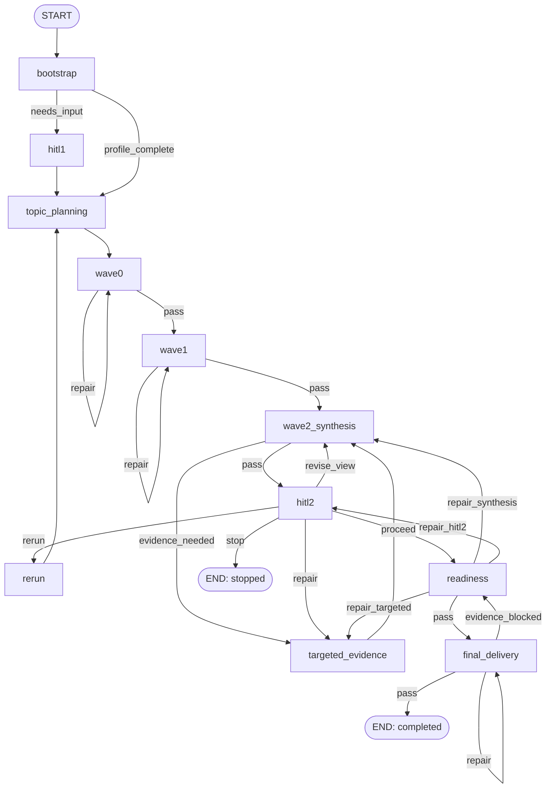

## Context

### Verified current behavior

- Change 00 is archived. `agent/src/deerflow_deep_research/runtime/graph_host.py`
  provides a generic action registry, same-namespace lock striping, startup-fingerprint
  verification, and one official checkpointer context per action.
- `agent/src/deerflow_deep_research/runtime/probe.py` registers only
  `infra_probe`; `agent/src/deerflow_deep_research/tool.py` currently accepts only an
  optional `probe_id` and returns lifecycle actions as unavailable.
- `RuntimeAdapter` produces a runtime-only `TrustedRuntimeEnvelope` and
  `runtime/projection.py` can derive a pure `GraphContextView` only after a registered
  handler validates an opaque research id.
- `domain/node_spec.py` already fixes the public node surface: one `NODE_SPEC`, a
  real and fake factory accepting `NodeBuildDependencies`, private typed contracts,
  and explicit registry loading.
- DeerFlow's pinned LangChain/LangGraph stack exposes `ToolRuntime.tool_call_id`,
  accepts tools returning public `Command` values, supports `interrupt()` and
  `Command(resume=...)`, and preserves `ToolMessage.artifact` plus
  `HumanMessage.additional_kwargs` through the Gateway message normalizer.
- The existing Web UI human-input contract is generic. It recognizes a version-1
  `artifact.human_input` request on any `ToolMessage` and returns a real
  `HumanMessage` carrying `additional_kwargs.human_input_response`; no frontend change
  is required.
- The default reflected dispatch currently constructs a fresh probe `GraphHost` per
  invocation. Tests can inject one retained host, but lifecycle actions and memory-mode
  same-process resume require one process-local combined host in normal dispatch.

### Constraints

- Source and tests stay under `agent/`; `backend/` and `frontend/` remain unchanged.
- The `infra_probe` topology, namespace, and public behavior remain independently
  available.
- The graph recipe may be cached, but trusted envelopes, reduced dependencies,
  capabilities, user/thread values, research ids, and checkpointer resources may not
  be cached or checkpointed.
- File-SQLite is the required restart-durable backend. Memory and SQLite memory mode
  are same-process only. Postgres, live Docker verification, launch wrappers, and
  multi-worker coordination remain deferred.
- This change is zero-API: no model, web, MCP, ACP, DeerFlow `task` subagent, or
  sandbox research tool is invoked.
- Full `ResearchState`, work units, evidence, submission authority, and report
  delivery belong to later changes. The skeleton state must be intentionally small
  and replaceable without becoming a second business-state authority.

## Goals / Non-Goals

### Goals

- Freeze one stable logical topology and one implementation-selection mechanism before
  any real node exists.
- Exercise every phase, pass/repair/rerun/stop route, two real LangGraph interrupts,
  deterministic `Send` fan-out/fan-in, lifecycle control action, and terminal state.
- Bridge a nested interrupt to DeerFlow's existing outer human-input card contract and
  resume only from the matching latest `HumanMessage` in trusted runtime state.
- Prove checkpoint isolation, duplicate/replay defenses, status/cancel semantics,
  idempotent start/result reprojection, same-process memory behavior, and file-SQLite
  process-restart recovery.
- Keep the graph recipe request-independent and keep all request authority outside
  checkpointed state.

### Non-Goals

- No real research logic, embedded node-agent role, LLM call, web access, evidence,
  cache, ledger, report, or sandbox output.
- No final long-term `ResearchState` or migration framework; change 02 owns those.
- No true concurrent cross-process cancellation. `cancel` terminates a checkpointed
  suspended lifecycle; cancellation of a currently executing outer action remains the
  existing DeerFlow/asyncio cancellation path.
- No scheduled/webhook auto-decision policy. Non-interactive contexts fail before a
  HITL-producing start/resume; change 17 owns explicit autonomous policy.
- No IM-channel human-input bridge. Current channel extraction is hard-coded to
  `ask_clarification`; contexts reduced from `channel_user_id` and/or `channel_name`
  fail HITL-producing actions until a separate upstream compatibility change exists.
- No new config key, mount, database provider, launcher, Docker live smoke, Postgres
  profile, worker-count support, or startup-only reload field.
- No modifications under `backend/` or `frontend/`.

## Decisions

### 1. One explicit topology owns logical phase order

`graph/topology.py` will declare the stable logical nodes and edges. The expected
control flow is:

Any fake repair/rerun budget exhaustion routes to a typed `blocked` terminal that is
part of the normalized semantic edge set even though it is omitted from repeated
diagram arrows for readability. Control `cancel` resumes the currently interrupted
HITL node into a typed `cancelled` terminal from either HITL phase.

`graph/routing.py` reads typed verdict fields only. It never performs model judgment,
filesystem inspection, or hidden mutable bookkeeping. The topology explicitly lists
package roots; it does not discover nodes from the filesystem.

Alternative considered: let each fake node decide and call its successor. Rejected
because routing would disappear into implementation code and later fake/real swaps
could silently change the workflow.

The default full-fake profile takes `bootstrap --needs_input--> hitl1`, preserving the
two-HITL happy path. A deterministic `profile_complete` fixture covers the bypass edge
now so the real bootstrap/HITL1 changes do not need to alter the stable topology later.

### 2. Phase packages are real structural surfaces even though behavior is fake

The change creates the eleven canonical node packages, each with `__init__.py`,
`node.py`, `fake.py`, and `contracts.py`; Wave0/Wave1 may additionally own
`subgraph.py`. The package root exports only `NODE_SPEC`.

The implementation map defaults every logical node to `fake`. Selecting `real` for a
node whose later change has not supplied an implementation fails during graph binding
with a typed `implementation_unavailable` error. Mixed-mode tests provide an explicit
test-owned NodeSpec/factory override; production code does not pretend an unavailable
real node exists.

The pure NodeSpec layer exposes one canonical `UNAVAILABLE_REAL_FACTORY` sentinel that
still satisfies the existing one-argument factory contract. Change-01 node packages
point `real_factory` at that sentinel. The implementation map checks the sentinel
before graph invocation; node packages do not invent eleven slightly different
raising placeholders and callers never need to execute a fake dependency binding just
to discover that real behavior is absent.

Alternative considered: omit `node.py` or real factories until later. Rejected because
it violates the permanent node-package grammar and would force structural churn on
every replacement change.

### 3. Request-independent graph recipe, request-scoped invocation context

The cached `StateGraph` recipe uses a public LangGraph `context_schema`. Generic node
wrappers read a domain-owned, frozen invocation context containing only:

- the pure `GraphContextView`;
- a domain protocol for resolving reduced `NodeBuildDependencies` from a logical node,
  stable attempt id, and declared `PolicyRef` at the moment that node executes;
- no inspectable raw DeerFlow authority field.

The research action handler constructs that context after `RuntimeAdapter` and
`project_research_scope()` validate the trusted scope, then passes it through the
public `context=` invocation argument. It is not part of graph state and is therefore
not checkpointed. A runtime-owned resolver closes over the already reduced
`GraphContextView` and a `NodeExecutionCapabilities` implementation. That concrete
capability may internally own the TrustedRuntimeEnvelope as established by change 00,
but graph/node code sees only the domain protocols and cannot read the envelope. At node execution,
the wrapper derives a deterministic attempt id from checkpointed generation/counters,
asks the resolver for fresh dependencies, selects the implementation, invokes the
NodeSpec factory, and calls the resulting node callable. This supports multiple repair
or rerun attempts within one action; a precomputed per-node map would incorrectly reuse
the first attempt id.

The attempt id format is the bounded opaque control value
`g<generation>-<logical_node>-a<attempt_counter>`; it contains no user/thread identity
and is recomputed rather than persisted as a second cursor. `attempt_counter` is one
plus the count of completed visits for that logical node in the checkpointed bounded
trace before the current invocation. A crash before the node transition commits
therefore retries with the same attempt id, while every committed repair/rerun/revisit
receives the next id.

`TrustedRuntimeEnvelope`, AppConfig, parent sandbox objects, host paths, raw identity,
outer run ids, and internal checkpoint keys never become invocation-context data
fields, graph state, checkpoint content, node inputs, or model-visible values. They may
exist only inside the fresh runtime-owned resolver/capability implementation behind the
pure protocols.

Alternative considered: rebuild a request-specific graph per action. Rejected because
it discards the request-independent topology cache promised by change 00 and makes
topology identity harder to snapshot. Alternative considered: put dependencies in
graph state. Rejected because they are runtime authority and are not serializable
business state.

Fixture controls are deliberately absent from invocation context. The handler/test
factory validates the selected closed fixture plan once at start and places that plan
in initial skeleton state. Every fake reads the checkpointed plan, so resume/restart
cannot receive a second request-scoped fixture authority or drift from the committed
route sequence.

### 4. A minimal versioned skeleton state, not the final ResearchState

`graph/skeleton_state.py` will define only fields needed to prove control flow. Shared
lifecycle/control-result enums remain pure domain contracts, but the temporary
change-01 checkpoint schema and reducers stay graph-owned so they do not compete with
the canonical `domain/state.py` reserved for change 02:

- `schema_version`, opaque `research_id`, lifecycle `status`, current `phase`;
- opaque `start_message_id`, a domain-separated request digest, and a bounded exact
  fake-request text used only to keep the skeleton bootstrap contract testable;
- `generation`, bounded repair/rerun counters, deterministic route fixture keys;
- reducer-backed Wave0/Wave1 branch result tuples;
- consumed response request/message ids for replay defense;
- typed terminal reason and a bounded logical execution trace.

Change-01 constants make the fake-only bounds explicit and testable:
`MAX_START_REQUEST_CHARS=16_384`, `MAX_CONTROL_RESULT_CHARS=4_096`,
`MAX_FAKE_TRACE_ENTRIES=256`, `MAX_FAKE_REPAIR_ATTEMPTS=3`, and
`MAX_FAKE_RERUN_GENERATIONS=2`. Oversized input/result fails rather than truncating
semantic data; exhausted fake repair/rerun budgets route to typed `blocked`.

No source document body, user identity, host path, sandbox handle, AppConfig,
checkpointer key, evidence payload, or report body is stored. The bounded start request
is user-authored lifecycle input, not runtime authority, and its digest anchors
idempotent bootstrap/future migration tests. Unknown schema versions fail closed before
resume or mutation. Change 02 must migrate the checkpoint contract to canonical
`domain/state.py`, update the graph builder, and remove `graph/skeleton_state.py`; it
must not leave two state authorities.

Alternative considered: implement the full planned ResearchState now. Rejected because
its reducers, artifact references, and persistence contract are the explicit scope of
change 02.

### 5. Wave phases prove parallel semantics inside phase-local subgraphs

Wave0 and Wave1 each own a deterministic phase-local subgraph with one dispatcher,
three `Send` branches, a reducer-backed result collection, and one join. The top-level
logical topology still sees only `wave0` and `wave1`; dispatch/join workers are internal
components and never become top-level phases.

The optional package-local `subgraph.py` may import public LangGraph APIs, and a HITL
`fake.py` may import exactly public `langgraph.types.interrupt`. Other `node.py`,
`fake.py`, `contracts.py`, and package roots retain the domain/engine-only boundary;
neither exception can import runtime, agents, graph implementation modules, or sibling nodes. The project-structure delta,
registry, checker, and generated guide block are updated together for this narrow rule.

The fake branch result contains only a stable branch id and fixture verdict. The
validated fixture plan is a closed deterministic data contract selected by a
test/handler factory (the production default is the happy profile), never a public tool
argument or model-controlled value. The selected plan/route sequence is copied into the
initial skeleton state so resume and subprocess restart do not depend on retaining the
original Python fixture object. Result
ordering is normalized before it re-enters the parent state so scheduling order cannot
make snapshots flaky. Phase-local subgraphs use no independent persistent business
state or checkpointer; restart durability in this change is proven at graph-owned HITL
boundaries. Durable work-unit execution remains change 04.

Alternative considered: add dispatcher/join names to the top-level topology. Rejected
because those are reusable implementation components rather than logical phases and
would make later internal worker changes a breaking topology change.

### 6. Nested HITL uses LangGraph interrupt plus DeerFlow's existing message contract

Each HITL node calls public `interrupt()` with a deterministic, versioned request
descriptor. LangGraph checkpoints the suspension before the handler returns control.
The handler then projects the pending descriptor into a `ToolMessage` whose:

- `tool_call_id` is `ToolRuntime.tool_call_id`;
- stable message id equals the research HITL request id;
- `name` is `deep_research`;
- `artifact.human_input` is the existing version-1 `human_input_request` schema with
  source `deep_research`, a title/context that explicitly says
  `implementation_mode=full_fake`, and no claim that the question belongs to a real
  research run.

The reflected tool returns `Command(update={"messages": [...]}, goto=END)` so the
current lead-agent turn ends after the nested checkpoint is durable. An early
viability test must prove the reflected async tool's `Command`, `ToolMessage`, and
artifact survive the pinned ToolNode/runtime path. Failure of that gate stops the
change and triggers a design revision; upstream code is not edited.

The LangGraph checkpoint interrupt task is the only pending-request authority; skeleton
state does not duplicate a mutable `pending_hitl` field. A request id is `drh_` plus a
domain-separated digest of research id, HITL phase, generation, and HITL ordinal. The
ordinal is derived from already checkpointed logical HITL visits in the bounded trace,
so the node computes the same id when LangGraph restarts it on resume, while a later
HITL2 in the same generation receives a new id. Status/resume inspect interrupt tasks
from `aget_state()`; a suspended lifecycle's one descriptor also carries the opaque latest outer
HumanMessage id observed by the action at suspension, so response ordering needs no
second state cursor. The cursor remains internal and is omitted from the outer artifact
and control result. A suspended lifecycle must have exactly one pending interrupt;
multiple interrupts are always inconsistent, while zero is valid only for a typed
terminal lifecycle or for the locked action before it reaches suspension.

On resume, tool arguments contain only `action` and `research_id`. After reading the
checkpoint, the handler first compares the latest actual trusted-state `HumanMessage`
with checkpointed consumed request/message ids. An exact match is a result-delivery
retry: the handler reprojects the current durable interrupt or terminal result without
requiring the old interrupt to remain pending and without invoking the graph. Otherwise,
a fresh response requires exactly one pending interrupt, and the handler scans messages
from newest to oldest for the latest actual `HumanMessage` after that interrupt's
suspension cursor. A structured
`human_input_response` payload, when present, must use source `deep_research` and match
the pending request id; its `value` is accepted only because it is attached to that
actual HumanMessage. For a non-card client, a newer visible HumanMessage without
structured metadata may provide its normalized text. Tool arguments, AI messages,
ToolMessages, hidden summaries/dynamic context, pre-suspension messages, mismatched
request ids, and empty values are rejected. An already-consumed message is never
accepted as a new answer; only the exact checkpointed request/message pair may trigger
read-only reprojection of the durable outcome it already produced.

The extractor creates a pure `AcceptedHumanResponse` containing the pending request id,
outer HumanMessage id, exact value, response kind, and optional option id. That typed
value is supplied through `Command(resume=...)`; the resumed HITL node itself validates
the request and records consumed request/message ids plus the completed logical HITL
visit in the same graph transition. LangGraph consumes the pending interrupt through
normal resume semantics; runtime code never patches interrupt or checkpoint fields out
of band.
Cancel uses a distinct internal resume-decision variant, so a cancel cannot be confused
with user text. Duplicate or stale resume calls never advance a second interrupt.

HITL1 is a bounded free-text fixture. HITL2 advertises stable options whose ids and
machine values map exactly to `proceed | revise_view | repair | rerun | stop`.
Structured option responses must match both the pending option id and its canonical
value; a plain client response must equal one advertised machine value after trim and
lowercase normalization. Mismatched id/value, unknown choice, or oversized text returns
`response_invalid` before `Command(resume=...)`, leaving the pending interrupt intact.

Alternative considered: accept an `answer` tool argument. Rejected because the model
could forge it. Alternative considered: reuse `ask_clarification`. Rejected because
phase agents are forbidden to own HITL and the nested graph needs its own checkpointed
suspension/correlation semantics.

### 7. Start correlation, lifecycle actions, and control results are one protocol

The strict tool schema remains `extra="forbid"` and uses bounded action-specific
validation:

- `infra_probe`: optional `probe_id`, no `research_id`;
- `start`: neither id nor question is caller-supplied; runtime code selects the latest
  visible genuine user `HumanMessage`, rejects a human-input response, requires its
  stable message id, and reads its bounded exact text;
- `resume | status | cancel`: require one bounded opaque `research_id` and reject
  `probe_id`;
- unknown bounded actions still return redacted `action_unavailable` before adapter or
  sandbox access.

For every research lifecycle action, dispatch also inspects the latest outer AIMessage
and requires the active `ToolRuntime.tool_call_id` to be its one and only tool call,
named `deep_research`. Missing call correlation, two deep-research calls, or any sibling
built-in/configured/MCP/ACP call returns `exclusive_control_call_required` before
RuntimeAdapter, namespace derivation, or nested mutation. ToolNode may already execute
sibling calls concurrently, so this check makes no claim to cancel them; it only refuses
to combine research lifecycle mutation with that ambiguous outer turn. The independent
change-00 infra probe keeps its existing behavior.

The dispatch precedence is fixed so mixed-invalid inputs cannot reach a more privileged
layer or produce inconsistent errors:

1. strict Pydantic shape/cross-field validation and research-id grammar;
2. registered-action lookup (unknown bounded action remains the change-00 redacted
   `action_unavailable` path);
3. lifecycle sole-tool-call correlation from runtime state;
4. RuntimeAdapter trust/fingerprint/sandbox validation and reduction of interaction/
   transport capability;
5. start-message selection for start (other actions already have a schema-valid id);
6. per-action provider context and namespace lock, followed by checkpoint/pending
   inspection, resume-answer correlation where applicable, graph inspect/invoke, and
   result projection.

No later failure may mask or trigger work from an earlier rejected layer. Resume
classification occurs only after the trusted checkpoint has been loaded: an exact
checkpointed consumed request/message pair is handled first as read-only result
reprojection; every fresh answer is selected only after exactly one pending interrupt
has been loaded, because request/option correlation depends on that descriptor.

The start selector ignores non-Human messages and hidden synthetic/summary/dynamic
context while locating the newest visible genuine HumanMessage. It never falls back
past that candidate: if the candidate is itself a human-input response, lacks a stable
id, or has invalid content, start is denied instead of silently reusing an older user
request. Accepted content is either a string or an ordered list containing only
`{"type":"text","text":<string>}` blocks; list text is concatenated in order with no
inserted separator. Non-text/malformed blocks, empty text, and text above 16,384
characters are rejected rather than dropped or normalized.

For fresh resume, a structured `human_input_response` remains genuine even when the
outer UI marks that response message hidden; other hidden HumanMessages are synthetic
and ignored while locating the newest candidate after the suspension cursor. Once a
newest candidate exists, correlation/content failure denies it without substituting an
older message. Plain-response content uses the same string/text-only-block extraction,
then applies only the response mode's documented bounded normalization.

RuntimeAdapter/research control reduces the internal server-owned
`context.non_interactive` flag and the fail-closed `context.disable_clarification`
signal to one `interaction_allowed` capability. Arbitrary clients cannot set the
internal scheduled flag through Gateway; supplying the clarification-disabled signal
can only remove capability, not grant autonomous behavior. The lifecycle does not
reinterpret either signal as a user answer. When interaction is unavailable, `start` and `resume` return typed
`interactive_required` before namespace mutation or graph invocation. `status` remains
read-only and `cancel` may terminate an already suspended lifecycle. Change 17 may add
a distinct checkpointed auto-decision policy; change 01 never silently proceeds.

Transport capability is independent from interaction policy. The current Web UI and
generic LangGraph message clients can consume version-1 `artifact.human_input`, but
`backend/app/channels/manager.py` currently extracts clarification ToolMessages only
when their name is `ask_clarification`. The checked Gateway explicitly forwards
`channel_user_id` as runtime-context-only data for IM calls; `channel_name` is also
accepted when present. RuntimeAdapter immediately reduces either marker to a boolean
transport capability and never exposes or checkpoints the raw platform identity. Since downstream code cannot edit `backend/`, change 01 returns typed
`human_input_transport_unavailable` before HITL-producing start/resume in a known
channel context; status/cancel stay available. It does not append a synthetic AI answer
or mislabel the deep-research tool as `ask_clarification`. Enabling generic IM human
input requires a separate explicit upstream change and updated channel tests.

Start computes `research_id` as `r_` plus unpadded URL-safe base64 of SHA-256 over the
canonical UTF-8 JSON array
`["deep-research/thread/v1", effective_user, outer_thread]`. JSON uses
`ensure_ascii=False`, compact separators, and UTF-8 encoding, preserving string
boundaries and Unicode deterministically while preventing concatenation ambiguity.
The id is opaque and collision-resistant but is not treated as authorization; later namespace
derivation still includes trusted user/thread scope. This deterministic derivation is
required for at-least-once delivery: retrying the same start after the nested checkpoint
was written but before the outer ToolMessage was delivered finds the same lifecycle and
reprojects its pending result. The checkpoint separately stores the start HumanMessage
id/digest: the same correlation is an idempotent retry, while a different eligible start
message in the same outer thread returns `thread_research_exists` with the existing
opaque research id/status and does not reset or create another lifecycle. A new research
uses a new outer thread. This implements the roadmap's no-multi-active-run boundary
without introducing a second active-index checkpoint authority.

The public research-id grammar is exact: `^r_[A-Za-z0-9_-]{43}$` (SHA-256 base64url
without padding). Lifecycle resume/status/cancel reject every other shape before
RuntimeAdapter/provider access; the broader probe-id grammar remains unchanged and the
two id domains cannot be confused.

All research handlers derive the same versioned namespace from trusted user, outer
thread, and research id. `status` uses `aget_state()` only. A fresh `resume` requires
one pending interrupt; an exact consumed-message retry only reprojects the already
durable outcome.
`cancel` resumes a pending HITL with an internal typed cancel decision so normal graph
routing records a terminal `cancelled` state; terminal cancel calls are idempotent
reads, while missing or unsupported states fail closed.

Transition outcomes are exact rather than implementation-defined:

- status on an existing lifecycle is always read-only;
- cancel on `completed | stopped | cancelled | blocked` returns that terminal result
  idempotently;
- resume with no pending interrupt, including every terminal lifecycle, returns
  `invalid_transition` with no mutation when the latest HumanMessage is not the already
  consumed response that produced the durable outcome;
- reuse of an already consumed request/message reprojects the current pending interrupt
  or terminal result without graph invocation, making resume result delivery
  at-least-once safe;
- a wrong-thread/wrong-user id is indistinguishable from absence and returns
  `research_not_found` without status disclosure;
- an unsupported checkpoint schema returns `schema_unsupported` before mutation.

Every research lifecycle request that passes strict schema and registered-action
validation emits a bounded version-1
`DeepResearchControlResult`. `schema_version`, `action`, `code`, provider durability,
and `implementation_mode="full_fake"` are always present. `research_id` is present only
when a validated/generated id may safely be returned. Lifecycle `status`, `phase`, and
`generation` are present only after an existing or newly committed lifecycle is known;
pre-lifecycle denials omit them rather than inventing graph state. A suspended result
adds `request_id`, and a terminal result may add a typed terminal reason. A denial that
occurs before provider classification uses the existing `unavailable` durability class.
The result never
includes user/thread identity, internal namespace, host paths, raw fixture plans,
checkpoint values, findings, evidence, citations, or report content. Normal actions serialize it as
the tool result. A suspended action serializes the same envelope into the outer
ToolMessage content and adds `artifact.human_input`, giving both non-UI clients and the
lead model a stable machine-readable reference. Reprojection after a delivery failure
uses the same research/request ids but the current outer `tool_call_id`.

Lifecycle-owned result codes are closed in version 1. Normal durable projections use
`suspended | completed | stopped | cancelled | blocked`; read-only status uses
`status_ok`. Lifecycle denials use only `start_message_invalid`,
`thread_research_exists`, `response_mismatch`, `response_invalid`,
`invalid_transition`, `research_not_found`, `schema_unsupported`,
`checkpoint_inconsistent`, `interactive_required`,
`human_input_transport_unavailable`, `exclusive_control_call_required`, or
`implementation_unavailable`. RuntimeAdapter/GraphHost may preserve an already-defined
change-00 redacted infrastructure code such as `restart_required`; arbitrary free-form
codes are forbidden. Strict schema diagnostics and unknown-action
`action_unavailable` remain the pre-lifecycle tool contracts and are not disguised as a
committed research lifecycle.

`infra_probe` deliberately keeps its change-00 result schema and never masquerades as a
research lifecycle result.

Because same-namespace actions hold the one-worker GraphHost lock for the whole action,
public status cannot observe an in-flight intermediate superstep. It reports the last
durable suspended or terminal checkpoint after serialization; the wire contract does
not claim a concurrently observable `running` state.

Same-namespace actions remain serialized by GraphHost's single-worker lock. If an outer
tool task is actively executing, DeerFlow run cancellation/ordinary asyncio
`CancelledError` remains the mechanism that aborts it; the control `cancel` action does
not claim cross-task or cross-worker preemption.

Alternative considered: generate a random research id. Rejected because a crash after
checkpoint commit but before result delivery would leave an unreachable orphan and a
retry would create a second lifecycle. Alternative considered: let the model pass the
question or research id. Rejected because start input must come from the actual user
message and identity/scope must remain server-bound. Alternative considered: include
the start message id in the research id. Rejected because that would permit multiple
simultaneous research lifecycles in one outer thread and conflict with the roadmap's
first-version boundary. Alternative considered: let a
scheduled/webhook run use the happy fake answers. Rejected because that silently turns
an interactive contract into autonomous policy. Alternative considered: append a
synthetic AIMessage so current IM extractors display the question. Rejected because it
creates a second presentation protocol and an assistant-authored message that can be
mistaken for graph output. Alternative considered: let cancel rewrite checkpoint values with `aupdate_state()`.
Rejected because it could bypass the topology and create a state the graph never
transitioned through.

### 8. HITL2, readiness, and final repair routes remain explicit

HITL2 uses the same closed decisions planned for its later real node:
`proceed`, `revise_view`, `repair`, `rerun`, and `stop`. `revise_view` returns to
`wave2_synthesis`; `repair` enters `targeted_evidence`; `rerun` increments generation
through the `rerun` node before `topic_planning`; `proceed` enters readiness; and stop
records a typed terminal.

`targeted_evidence` always returns to `wave2_synthesis`, which alone decides whether
another targeted round is needed or Wave2 may pass to HITL2. Readiness uses a typed
repair target (`targeted_evidence | wave2_synthesis | hitl2`) or pass. Final delivery
uses bounded self-repair for writer/integrity defects,
`evidence_blocked -> readiness` when it cannot repair without new evidence, or pass.
Wave0 and Wave1 likewise have independent bounded repair loops. These edges are part of
the semantic snapshot even though all verdicts are fixtures in change 01.

Alternative considered: send targeted evidence directly to HITL2 or collapse all
repairs into one generic back edge. Rejected because it bypasses synthesis/gate
reprojection and would make later real-node replacement change the top-level topology.

### 9. One process-local combined GraphHost preserves memory semantics

`runtime/control.py` will build a combined host registering `InfraProbeHandler` plus
the four research handlers. All four handlers reference the same versioned research
graph recipe/topology factory; an action cannot compile a status/cancel-specific graph
shape against the shared checkpoint namespace. `tool.py` resolves one lazily created process-local host by
default; tests may still inject isolated hosts. The host caches only request-independent
recipes and its memory saver. SQL saver contexts remain per action and close exactly as
in change 00.

This also makes the existing same-process memory revisit claim true for ordinary
reflected `infra_probe` dispatch. The host is not a distributed singleton and does not
change the one-worker readiness rule.

Alternative considered: construct a host per tool invocation. Rejected because memory
checkpoints would be discarded between actions and `resume/status/cancel` could not
work in the supported same-process memory mode.

### 10. Snapshot and E2E contracts are deterministic

`graph/topology.py` exposes a normalized node/edge representation used both to build
the graph and to render a committed Mermaid/text snapshot. Contract tests reject
unreachable nodes, duplicate logical names, implicit node discovery, unexpected edge
changes, or internal Wave dispatch components appearing as top-level phases.

E2E tests run the same public handler/tool surfaces with fixtures for:

1. happy path with two HITL suspensions;
2. Wave0 and Wave1 repair then pass;
3. targeted-evidence convergence plus HITL2 revise/repair routes;
4. HITL2 rerun to a second generation and HITL2 stop;
5. readiness repair targets and final-delivery repair;
6. durable cancel;
7. stale/wrong-thread response denial and consumed-response delivery reprojection;
8. failure after start checkpoint but before result delivery followed by idempotent
   reprojection;
9. file-SQLite subprocess restart between interrupt and resume.

Memory tests remain same-process and explicitly assert that restart recovery is not
claimed. No Postgres or Docker daemon is required.

### 11. Entry/configuration impact stays within existing surfaces

No `config.yaml` or `extensions_config.json` key changes. The reflection path remains
`deerflow_deep_research.tool:deep_research_tool`; MCP, ACP, `task` subagents, phase
skills, and DPT bundle files remain unused. The public skill and Agent/SOUL text label
the lifecycle as a development-only `full_fake` skeleton, require the lead to surface
that mode, and prohibit describing a fake terminal marker as research output. Those
text changes take effect on the next agent build. Python package
changes use the existing change-00 source-loading/restart boundary. No new
`reload_boundary.STARTUP_ONLY_FIELDS` value is affected.

## Risks / Trade-offs

- **[Risk] Public ToolNode `Command` behavior differs from the focused tool test.** →
  Make reflected-command/artifact propagation the first hard viability gate and stop
  before topology work if it fails.
- **[Risk] Latest HumanMessage selection consumes hidden synthetic context.** → Filter
  start and resume through separate selectors; reject response/synthetic messages for
  start, filter summary/dynamic-context markers for resume, require post-suspension
  ordering, prefer matching structured response metadata, and record consumed ids.
- **[Risk] Known IM channels silently lose the deep-research HITL ToolMessage.** → Detect
  reduced `channel_user_id`/`channel_name` presence, fail start/resume before mutation,
  and require a separate upstream channel-compatibility change rather than claiming support.
- **[Risk] Start result delivery fails after checkpoint commit.** → Derive the research
  id deterministically from trusted user/thread scope, store
  the start correlation, and make repeat start reproject the existing pending/terminal
  result rather than invoke a second lifecycle.
- **[Risk] Phase-local Send subgraphs do not prove crash recovery mid-wave.** → State
  this boundary explicitly; change 04 owns durable work units. Change 01 proves Send
  semantics and restart only at graph-owned HITL checkpoints.
- **[Risk] Minimal skeleton state becomes accidental long-term schema.** → Name and
  version it as skeleton-only, exclude business payloads, and make change 02 explicitly
  own replacement/migration.
- **[Risk] Process-local host/locks are mistaken for multi-worker coordination.** → Keep
  the worker-count readiness gate at exactly one and document no cross-process cancel or
  exclusion claim.
- **[Risk] A lead turn issues deep research beside another tool call.** → Require a
  uniquely correlated sole `deep_research` call before lifecycle dispatch and return a
  retryable typed denial without nested mutation when siblings exist.
- **[Risk] A real implementation is selected before it exists.** → Resolve the full
  implementation map before invocation and fail closed with the logical node name;
  never fall back silently to fake.
- **[Risk] Topology snapshots become formatting-noise tests.** → Snapshot a normalized
  semantic node/edge representation and generate diagrams from it, not from unstable
  LangGraph debug formatting.

## Migration Plan

1. Add red viability tests with a dedicated reflected fixture for
   `Command`/human-input artifacts, plus retained process-local infra-probe host behavior.
2. Add the graph-owned minimal skeleton schema, pure lifecycle contracts,
   implementation map, topology model, and structural registry entries; regenerate the
   controlled `agent/AGENTS.md` block.
3. Add node packages and deterministic phase-local Wave subgraphs.
4. Add the research graph recipe, separate start/resume HumanMessage selectors,
   deterministic start correlation, lifecycle handlers/result envelope, and combined
   host/tool schema.
5. Update public skill/Agent guidance and run unit/contract/graph/integration/E2E,
   file-SQLite subprocess restart, lint/format/lock, architecture, requirement, spec,
   and strict OpenSpec validation.

There is no persistent production migration because no deployed research graph exists.
Rollback removes the active change's new downstream source and entry-text changes; the
change-00 infra probe and main specs remain valid. A checkpoint written with the
skeleton namespace/schema is development-only until this change is archived; unknown
or removed schema versions fail closed rather than being reinterpreted.

## Open Questions

None. The first viability gate may invalidate the chosen outer `Command` bridge; if it
does, implementation stops and this design is revised before any topology work.
