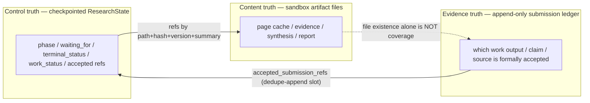

## Context

### Verified current behavior

Change 01 ships a temporary checkpoint payload in
`agent/src/deerflow_deep_research/graph/skeleton_state.py` whose docstring (lines 1-9)
states it "must migrate the graph builder to `domain/state.py` and remove this module;
both schemas must never coexist as authorities." It is a dual representation:

- `SkeletonState` (`graph/skeleton_state.py:162-181`) — a `total=False` `TypedDict`
  consumed by `StateGraph(SkeletonState, ...)` at `graph/builder.py:71`. Two fields carry
  reducers: `wave0_results` / `wave1_results` use `merge_branch_results`
  (`skeleton_state.py:40-48`, normalizes + rejects duplicate `branch_id`), and
  `execution_trace` uses `merge_trace` (`skeleton_state.py:51-55`, rejects len > 256).
- `SkeletonCheckpoint` (`skeleton_state.py:112-159`) — a frozen dataclass validation
  authority whose `__post_init__` enforces `SKELETON_SCHEMA_VERSION = 1`
  (`skeleton_state.py:37`, fail-closed at line 134), id regexes, length caps, consumed-id
  uniqueness, and enum coercion.

Fake nodes write state through `node_update` / `bounded_repair_update` in
`engine/fake_control.py:39-61`; research handlers project the checkpoint via
`_checkpoint(snapshot)` at `runtime/research.py:113-125` and write initial state at
`runtime/research.py:242-254`.

The checkpoint pipeline this change reuses — unchanged — is verified at:

- `backend/packages/harness/deerflow/runtime/checkpointer/async_provider.py:168-202`
  (`make_checkpointer(app_config)`, memory/SQLite/Postgres, per-action open/close).
- `agent/src/deerflow_deep_research/runtime/graph_host.py:127-172` (per-action provider
  lifecycle; `:174-181` same-namespace serialization via 64 striped locks).
- `runtime/checkpoint.py:28-30` (namespace constants), `:79-105`
  (`resolve_effective_provider`), `:153-175` (`derive_research_thread_key`,
  length-prefixed domain-separated digest), `:108-112` (probe schema gate).
- `runtime/research.py:56-62` (`derive_research_id`), `:229-239`
  (`THREAD_RESEARCH_EXISTS`), `:240` and `:270-276` (same-message start/resume
  idempotency).
- `runtime/runtime_adapter.py:108-140` (`adapt`), `runtime/identity.py:24-38`
  (`require_trusted_user_id`, refuses the generic `default` fallback).

Existing enums live in `domain/lifecycle.py`: `LifecycleStatus` (`:33-38`:
`suspended | completed | stopped | cancelled | blocked`), `LogicalPhase` (`:41-52`, 11
phases), `TerminalReason` (`:55-60`), `GateVerdict` (`:118-120`, `PASS | REPAIR`), and
`ResultCode.SCHEMA_UNSUPPORTED` (`:76`). The control-result wire envelope carries
`schema_version: Literal[1]` (`:261`) and `implementation_mode: Literal["full_fake"]`
(`:262`). `domain/` is frozen pure contracts (stdlib + pydantic only) per
`agent/AGENTS.md:135-144`.

### Constraints

- Source and tests stay under `agent/`; `backend/` and `frontend/` remain unchanged.
- `domain/` may use only stdlib + pydantic; `engine/` depends only on `domain/`; `graph/`
  depends on pure contracts plus explicitly listed nodes.
- The fake graph must keep its change-01 paths (routes, interrupts, terminal marker,
  restart resume) identical — only the payload type changes.
- No new DeerFlow extension surface is touched (no `config.yaml`, `extensions_config.json`,
  skill, Agent, MCP, ACP, or `task` subagent change).

## Goals / Non-Goals

**Goals:**

- Freeze one typed `ResearchState` authority in `domain/state.py` that 03, 04, and real
  nodes depend on, with explicit writer/reader/reducer ownership.
- Define the reducer invariants (terminal monotonicity, duplicate-hash idempotency,
  different-hash conflict, ref dedupe, sole-writer) and the content-ref + hard-size rule.
- Declare the three-authority boundary and the minimal bundle/path-containment contract.
- Establish the versioned fail-closed schema policy without business migration.
- Migrate the fake graph off `skeleton_state.py` with no behavioral change.

**Non-Goals:**

- No real gate rules, `WorkSpec` content, submission-ledger storage, or real bundle
  artifact writes.
- No business state migration — only the version field and fail-closed contract.
- No new runtime dependency (no `hypothesis`); reducer property tests use parametrized
  pytest.
- No files under `backend/` or `frontend/` are modified.

## Decisions

### 1. `ResearchState` lives in `domain/state.py` as a dual TypedDict + frozen validation model

`domain/state.py` declares a `ResearchState` `TypedDict` with `Annotated[..., reducer]`
fields for LangGraph, plus a frozen `ResearchCheckpoint` pydantic/dataclass validation
authority mirroring the change-01 `SkeletonState` / `SkeletonCheckpoint` split. Reducers
are pure functions colocated in `domain/state.py`.

**Rationale:** `domain/` is the dependency root that `engine/`, `graph/`, and later
`engine/gates/`, `engine/work_units/` depend on; state ownership is a domain contract, not
graph plumbing. The dual representation preserves LangGraph's `Annotated` reducer convention
and the proven fail-closed validation path.

**Alternative considered:** a single pydantic model used directly as the LangGraph state
schema. Rejected because change-01 established the TypedDict + frozen-validator pattern and
switching schemas would widen the diff and risk fake-path regression; reducers as
`Annotated` callables remain the clearest ownership signal.

### 2. ResearchState blocks and the three-field control model

`ResearchState` carries the blocks from the approved architecture
(`_backlog/plans/deerflow-native-deep-research-graph.md:317-348`): `identity`
(`research_id`, `outer_thread_id`, `generation`, `schema_version`), `request`, `control`
(`phase`, `phase_status`, `waiting_for`, `terminal_status`, `gate_attempts_by_phase`,
`repair_budget_by_phase`), `planning`, `work` (`work_specs_by_id`, `work_status_by_id`,
`accepted_submission_refs`), `quality` (`latest_gate_feedback`, gaps, degraded decisions),
and `delivery` refs. The single change-01 `LifecycleStatus` is reconciled into the
three-field control truth (`phase_status`, `waiting_for`, `terminal_status`); `LogicalPhase`
and `TerminalReason` are reused unchanged. A `WorkStatus` enum
(`pending | running | submitted | failed | timed_out | cancelled`) is defined with the work
block so the terminal-monotonicity reducer has a typed target, even though the fake graph
does not populate it.

**Rationale:** freezing the slot shape and the three-field control model now is exactly what
03 (gate feedback, attempt/budget counters) and 04 (work status, accepted refs, batch
cursor) consume; deferring would force them to redefine state ownership.

**Alternative considered:** defer `WorkStatus` and the work/quality slots to 04. Rejected
because the reducer invariants in this change reference `work_status` terminal monotonicity
and `accepted_submission_refs` dedupe — the enum and slot must exist to enforce and test
them.

### 3. Reducers enforce monotonicity, idempotency, conflict, dedupe, and sole-writer

Pure reducers in `domain/state.py` enforce: terminal `work_status` monotonicity (reject
`running`/stale on a terminal); exactly-one terminal winner per work/attempt; same
work/attempt + same content hash = idempotent (no append, no advance); same work/attempt +
different hash = `conflict` (not last-write-wins); `accepted_submission_refs` dedupe-append;
`latest_gate_feedback` / `phase` / `accepted_submission_refs` writable only by the gate node
/ controller, rejected from worker/planner/repair updates. Identity fields
(`research_id`, `outer_thread_id`, `generation`, `schema_version`) are reducer-rejected from
any node/worker.

**Rationale:** these are the master-plan reducer invariants
(`deerflow-native-deep-research-graph.md:354-361`) and the ownership rule 03/04 require. The
existing `merge_branch_results` / `merge_trace` reducers are preserved on the typed state.

**Alternative considered:** enforce ownership only via node-side discipline (no reducer
guard). Rejected — a worker bug or future node could then mutate gated authority; the
reducer is the mechanical enforcement point the spec scenario "Workers cannot write gated
authority" tests.

### 4. Content refs and a hard checkpoint-size bound

A `ContentRef` shape (`sandbox_path`, `content_hash`, `schema_version`, `short_summary`) is
the only way large content enters `ResearchState`. A `MAX_CHECKPOINT_STATE_BYTES` constant
rejects any state update whose serialized form exceeds the bound, mirroring `merge_trace`'s
`trace_too_large` (`skeleton_state.py:51-55`) and `MAX_START_REQUEST_CHARS`. Web bodies,
PDFs, full evidence/report text, screenshots, and large tool output are excluded by
construction. Raw `TrustedRuntimeEnvelope` / AppConfig / handles / credentials never enter
state.

**Rationale:** the acceptance criterion requires a hard test that oversized content fails;
soft truncation would silently corrupt evidence authority.

**Alternative considered:** enforce only field-level length caps without a whole-state
bound. Rejected — a reducer could accumulate many small refs past the safe checkpoint size;
the whole-state bound is the backstop.

### 5. Three authorities declared; no second phase cursor; ledger is a slot only

The design declares checkpointed `ResearchState` (control truth), the append-only validated
submission ledger (evidence truth), and sandbox artifact files (content truth) as distinct,
per `deerflow-native-deep-research-graph.md:376-385`. The graph checkpoint is the sole legal
execution path; no `rb_status.json` or equivalent second phase cursor exists.
`accepted_submission_refs` is a dedupe-append slot in `ResearchState`; the ledger storage
itself (JSONL + hash chain vs. SQLite/Postgres table) is NOT implemented and is deferred to
04. File existence, worker text, tool events, and `running` status do not count as accepted
submissions.

**Rationale:** freezes the authority boundary and the gate's read surface without building
ledger storage, which 04 owns.

**Alternative considered:** defer the entire three-authority declaration to 04. Rejected —
the boundary is what prevents 03/04 from accidentally putting evidence bodies into the
checkpoint or treating file existence as coverage; it must precede them.

### 6. Minimal bundle layout and path-containment contract in `domain/bundle.py`

`domain/bundle.py` declares the minimal bundle layout
(`workspace/deep-research/<research_id>/` with `request/`, `work/<work_id>/<attempt_id>/`,
`evidence/`, `synthesis/`, `review/`, `final/`, `diagnostics/`) and a path-containment
contract: a worker writes only its own `<work_id>/<attempt_id>/` directory and controlled
cache regions; out-of-root writes fail closed; canonical source URLs are deduplicated;
`diagnostics/gate-attempts.jsonl` is audit-only. The fake graph defines the contract but
writes no artifacts.

**Rationale:** the plan scope explicitly includes the bundle layout and path-containment
contract; `agents/middleware.py` write-roots exist but the research-bundle containment is
not yet codified.

**Alternative considered:** fold the bundle contract into `domain/state.py`. Rejected to
keep `state.py` focused on checkpointed control state; the bundle is a separate sandbox
contract.

### 7. Versioned schema with fail-closed, no business migration

`ResearchState.schema_version` is `RESEARCH_STATE_SCHEMA_VERSION = 2` (the skeleton was 1;
the payload shape changes, so v1 checkpoints fail closed as `schema_unsupported`). The
frozen validator's `__post_init__` preserves the change-01 fail-closed gate in typed form;
`ResultCode.SCHEMA_UNSUPPORTED` (`domain/lifecycle.py:76`) and the
`runtime/research.py:121-122` mapping are reused. On incompatible version the handler stops
— no silent reset, auto-migration, or reinterpretation. Business migration is explicitly out
of scope.

**Rationale:** preserves the proven fail-closed path while signaling the shape change;
honest because no production checkpoints exist.

**Alternative considered:** keep `schema_version = 1`. Rejected — the ResearchState shape
differs from the skeleton's, so reusing 1 would silently reinterpret an incompatible
payload, violating the fail-closed contract.

### 8. Test strategy reuses 00/01 fixtures; parametrized pytest, no hypothesis

- Unit reducer tests: `agent/tests/unit/test_state_reducers.py` — terminal monotonicity,
  same-hash idempotency, different-hash conflict, ref dedupe, sole-writer rejection,
  identity-write rejection. Precedent: `test_skeleton_contracts.py:87-94` (branch reducer).
- Checkpoint-size hard test: `agent/tests/unit/test_state_bounds.py` — oversized content
  rejected. Precedent: `merge_trace` `trace_too_large`.
- Per-backend namespace/isolation: `agent/tests/integration/test_state_persistence.py`,
  extending the `test_provider_durability.py` pattern (memory same-process, file-SQLite
  restart-durable via `agent/tests/fixtures/sqlite_research_subprocess.py`, Postgres
  deferred under `@pytest.mark.postgres`). Reuses `_sqlite_config` / `_memory_config` /
  `_envelope` fixtures and `build_control_graph_host`.
- Restart/resume/duplicate-update property tests: reducer logic in `tests/unit/`,
  cross-restart persistence in `tests/integration/` via `make test-durability`.

**Rationale:** matches the repo's TDD + deterministic-fakes convention; parametrized pytest
covers the property space without a new dependency.

**Alternative considered:** add `hypothesis` for richer property tests. Rejected — adds a
runtime dependency for coverage the parametrized cases already provide; 04 may revisit if
its state machine needs exhaustive generation.

## Risks / Trade-offs

- **[Risk] Splitting `LifecycleStatus` into three control fields regresses change-01
  paths.** → Mitigation: preserve the single `status` projection in the control-result
  envelope (wire-stable v1); the three-field split is internal to `ResearchState`. The
  fake-graph route/interrupt tests pin behavioral identity.
- **[Risk] Defining work/quality slots and `WorkStatus` before 03/04 finalizes their shape
  forces a later modification.** → Mitigation: slots are typed but unpopulated by the fake
  graph; a future field addition follows the writer/reader/reducer rule rather than
  redefining authority. Trade-off accepted: freezing early is the point of this change.
- **[Risk] Bumping `schema_version` to 2 invalidates any in-flight dev/test skeleton
  checkpoint.** → Mitigation: no production checkpoints exist; dev SQLite files are
  disposable. The fail-closed gate returns `schema_unsupported` rather than corrupting.
- **[Risk] Whole-state size bound rejects a legitimately large but valid control
  update.** → Mitigation: the bound targets checkpoint safety, not normal control fields;
  normal state stays far under the bound (change-01 already serializes control results to
  ≤ 4,096 chars). Oversized updates indicate content that should be a sandbox ref.
- **[Risk] Path-containment contract is declared but not exercised by real worker writes
  until later changes.** → Mitigation: a focused unit test asserts the containment helper
  rejects out-of-root paths; real-write coverage arrives with 04.

## Migration Plan

1. Add red unit tests for reducer invariants, the size bound, schema fail-closed, and
   identity-write rejection.
2. Add `domain/state.py` (`ResearchState`, `ResearchCheckpoint`, reducers, `ContentRef`,
   `WorkStatus`, `RESEARCH_STATE_SCHEMA_VERSION = 2`) and `domain/bundle.py` (layout +
   path-containment).
3. Migrate `graph/builder.py:71` to bind `ResearchState`; update `engine/fake_control.py`
   node update helpers and `runtime/research.py` checkpoint projection / initial-state
   write to the typed state.
4. Remove `graph/skeleton_state.py`; rename/extend `test_skeleton_contracts.py` to
   `test_state_contracts.py`.
5. Add per-backend isolation tests in `tests/integration/test_state_persistence.py`;
   run `make test-durability` for the file-SQLite restart gate.
6. Run `python3 openspec/governance/check_project_reqs.py`,
   `python3 openspec/governance/check_project_specs.py`, and
   `openspec validate define-deep-research-state-persistence-contracts --type change --strict`.

There is no persistent production migration because no deployed research graph exists.
Rollback is reverting the change; no data migration is required.

## Open Questions

- **Submission ledger storage** (JSONL + hash chain vs. SQLite/Postgres table): explicitly
  deferred to change 04; this change defines only the `accepted_submission_refs` slot and
  its sole-writer rule.
- **`WorkStatus` enum home** (`domain/state.py` vs. `domain/lifecycle.py`): proposed
  `domain/state.py` since it ships with the work block; if 03/04 prefer enum cohesion in
  `lifecycle.py`, that is a mechanical move with no spec impact.
